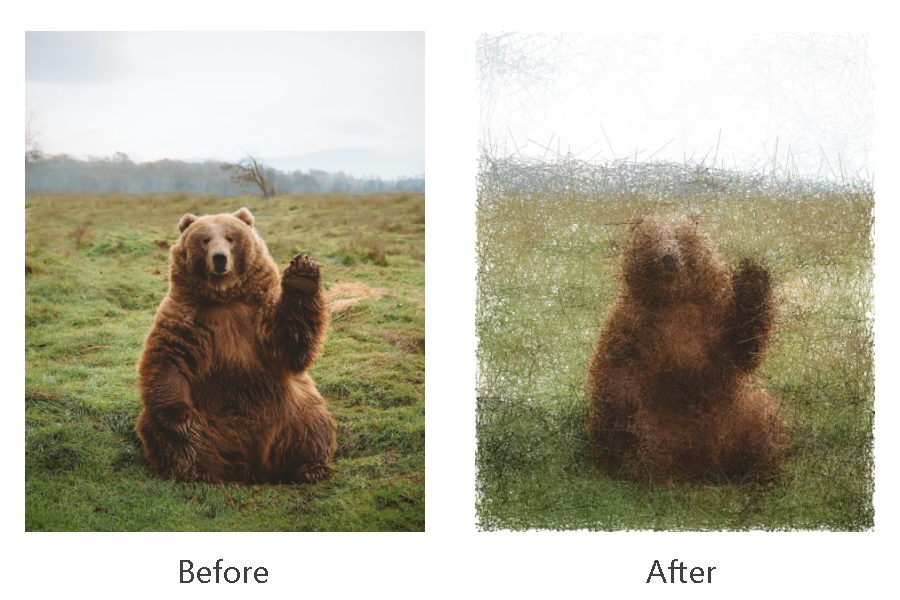
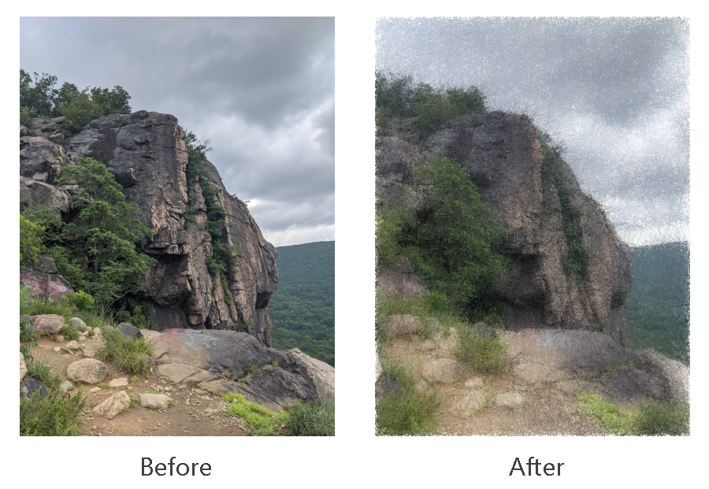

A Python script which 'samples' points from an image by treating their lightness as a density and running a 
Metropolis Hastings algorithm, and then uses these points to render a 'reconstruction' of the image. You can either
download the command-line Python script (image-mcmc.py), or look at the notebook version 

## Examples 
Some examples of original images and their 'sampled' versions:




Here, the total number of samples drawn (including possible duplicates) is around 5 to 10 percent of the
total number of pixels in the image. For some of the examples above, the standard deviation of the proposal
distribution is specified to vary in different parts of the image.

## Instructions for use

The command-line Python script requires the following packages; 
alternatively the requirements.txt file
can be used to create a working environment for the script. The script
works on Python 

* [NumPy](https://numpy.org/) (`numpy>=1.21.3`)
* [Click](https://click.palletsprojects.com/en/7.x/) (`click>=8.0.3`)
* [tqdm](https://tqdm.github.io/) (`tqdm>=4.62.3`)
* [OpenCV](https://pypi.org/project/opencv-python/) (`opencv>=4.5.3`)
* [Scikit-Image](https://scikit-image.org/) (`scikit-image>=0.18.3`)

There is also a notebook version which runs on Google Colab.

The command-line script takes in a few arguments in order to render
an image; for example, the second example was obtained via running
the code

```
python -m image-mcmc --fname test-images/bbridge.jpg --it_num 300000 --band 100 --export_fname test-images/bbridge-mcmc.jpg
```

For further details on how to use the script, run
```
$ python image-mcmc.py --help
```
to see the various arguments which can be passed to the script.