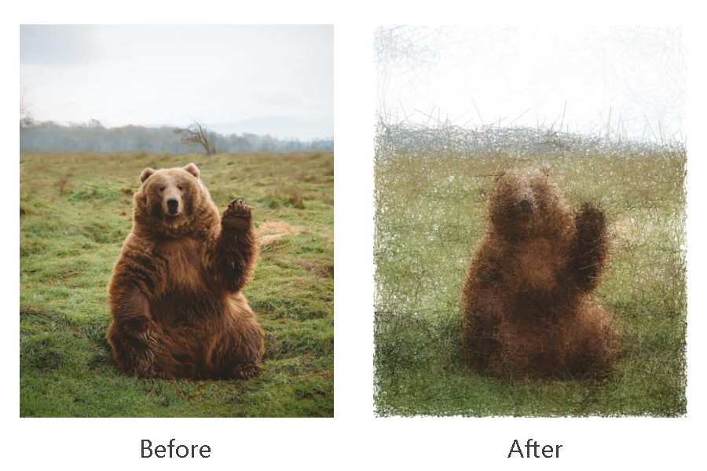

A Python script which 'samples' points from an image by treating their lightness as a density and running a 
Metropolis Hastings algorithm, and then uses these points to render a 'reconstruction' of the image. You can either
download the command-line Python script (image-mcmc.py), or look at the notebook version 

## Examples 
Some examples of original images and their 'sampled' versions:



Here, the total number of samples drawn (including possible duplicates) is around 5 to 10 percent of the
total number of pixels in the image. For some of the examples above, the standard deviation of the proposal
distribution is specified to vary in different parts of the image.

## Instructions for use

To use the command-line script, you'll need to have the following packages installed

* [NumPy](https://numpy.org/)
* [Click](https://click.palletsprojects.com/en/7.x/)
* [tqdm](https://tqdm.github.io/)
* [OpenCV](https://pypi.org/project/opencv-python/)
* [Scikit-Image](https://scikit-image.org/)

If you can't be bothered to install this all, feel free to adapt the notebook version which can be 
run through Colab.

For details on how to use the script, run
```
$ python image-mcmc.py --help
```
to see the various arguments which can be passed to the script.
